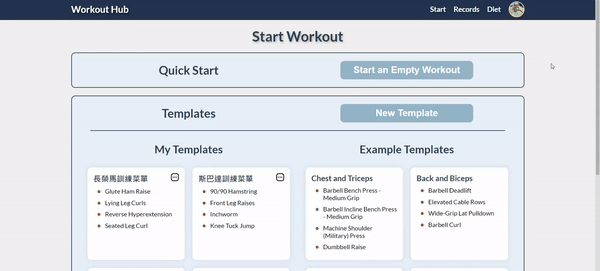
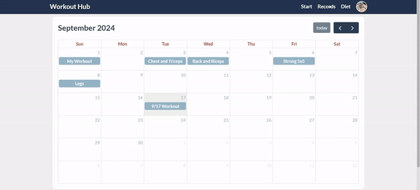
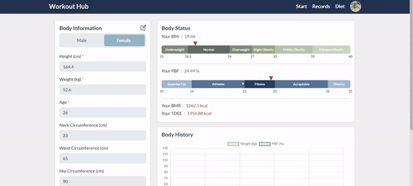
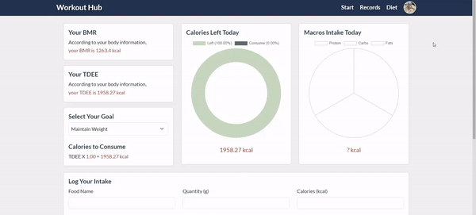
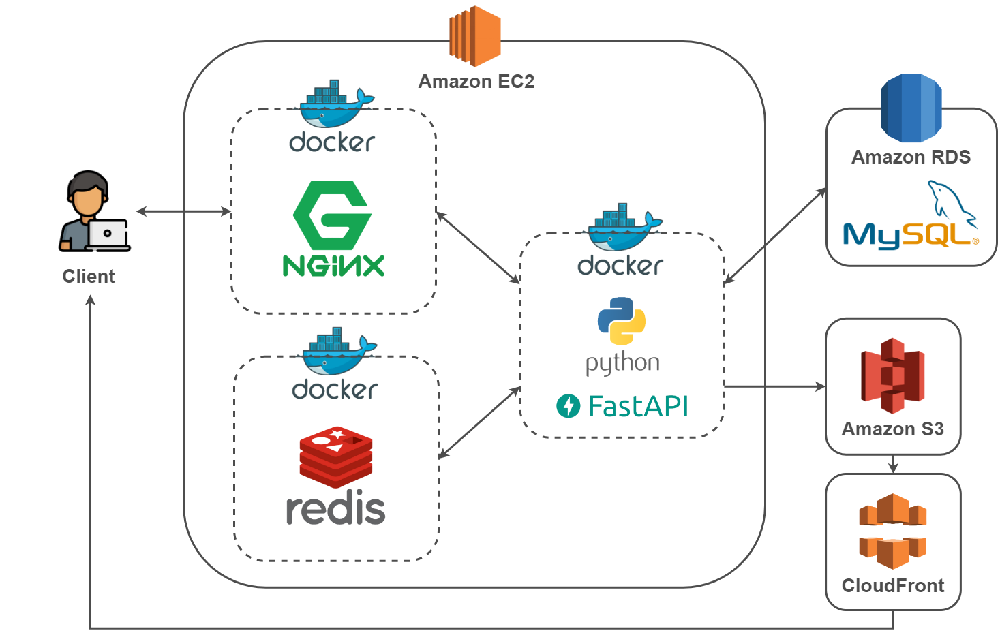
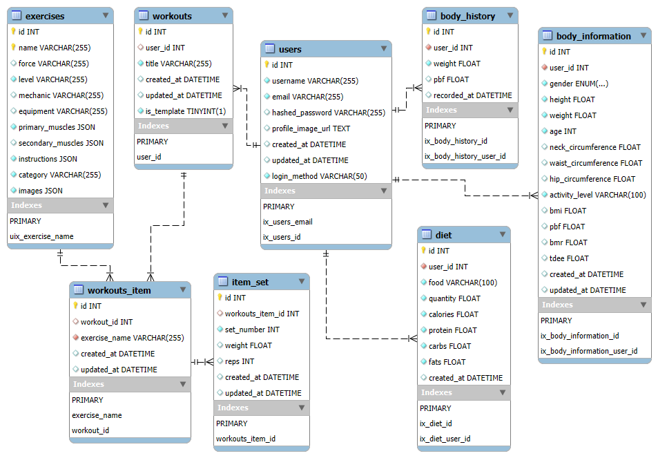

# [Workout Hub](https://workouthub.site/)

### A platform for tracking workouts, managing nutrition, and reaching your fitness goals.

### Table of contents

- [Main Features](#main-features)
- [Demo](#demo)
- [Server Architecture](#server-architecture)
- [Database Schema](#database-schema)
- [Technique](#technique)
- [Contact](#contact)

---

### Main Features

- Member system
- Record weight training program
- View workout history
- Analyze and track body composition
- Provide diet control recommendations

---

### Demo

- Member system: Login by creating an account or with Google.

- Record weight training program: Easily begin workout by starting an empty workout or using templates.

- View workout history: Monitor progress with detailed workout records stored in personal calendar.

- Analyze and track body composition: Keep an eye on body fat, BMR, TDEE, and other important health indicators.

- Provide diet control recommendations: Track daily calories and macronutrient intake to meet fitness goals.

---

### Server Architecture

---

### Database Schema

---

### Technique

- Front-End
    - HTML, CSS, JavaScript, Bootstrap
- Back-End
    - Web Framework : Python FastAPI
    - Database : MySQL
    - Cache : Redis
    - Container : Docker
    - Reverse Proxy : Nginx
    - Cloud : AWS RDS, S3, CloudFront, Route 53
    - Third-Party : Google Login
    - Design Pattern : MVC

---

### Contact
 **許珮萱 Pei Hsuan Hsu**  
 Email: [hsupei0514@gmail.com](mailto:hsupei0514@gmail.com)  
 LinkedIn: [Pei Hsuan Hsu](https://www.linkedin.com/in/pei-hsuan-hsu-0841a52bb/)
